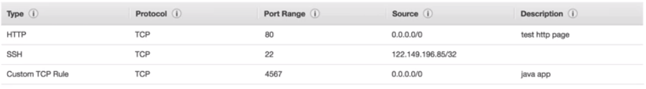
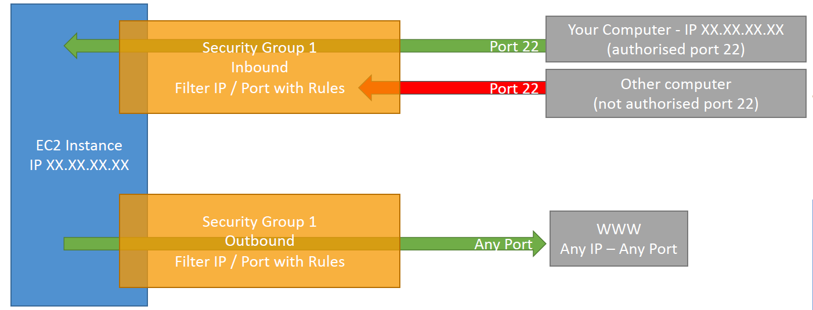
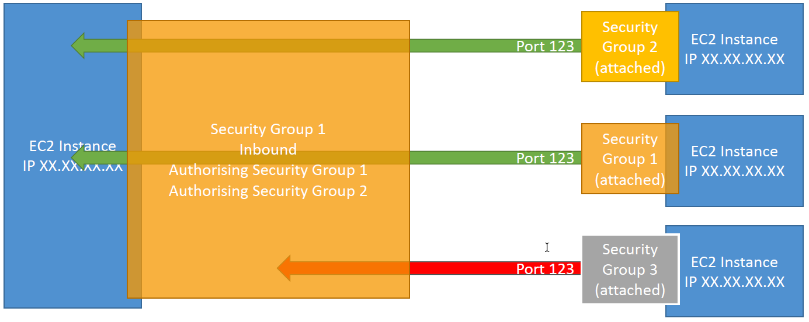

# EC2

> To connect to a EC2 instance via SSH 
> `ssh -i .\EC2Tutorial.pem ec2-user@18.156.37.84`
>  .\EC2Tutorial.pem - The PEM-File from an authorized user 
>  @18.156.37.84 - The public IP-address from your instance 


- EC2 = **Elastic Compute Cloud** which is part of Infrastructure as a Service
 - Capabilities:
    - Renting virtual machines (EC2)
    - Storing data on virtual drives (EBS)
    - Distributing load across machines (ELB)
    - Scaling the services using an auto-scaling group (ASG)

> Be aware that the public IP address always changes on restart of the instance, only the private IP address will remain the same.


## Sizing and Configuration Options:

- Operating Systems: Linux, Microsoft or Mac OS
- Compute Power & Cores (CPU)
- Random-Access memory (RAM)
- Storage Space
    - Network-attached (EBS & EFS)
    - hardware (EC2 Instance Store)
- Network card: Speed of the card, Public IP Address 
- Firewall rules: Security group
- Bootstrap script (configure at first launch): EC2 User Data

## EC2 Script

- It is possible to bootstrap instances using an EC2 User data script
- bootstrapping means launching commands when a machine starts
- The script runs only once at the first start of the instance
- used to automate boot task like:
    - installing updates
    - installing software
    - Downloading common files from the internet
    - Anything you want ...
- it runs with the root user


```bash
#!/bin/bash
# Use this for your user data (script from top to bottom)
# install httpd (Linux 2 version)
yum update -y
yum install -y httpd
systemctl start httpd
systemctl enable httpd
echo "<h1>Hello World from $(hostname -f)</h1>" > /var/www/html/index.html
```
## EC2 Instance Types

Naming Conventions:

    m5.2xlarge

- m: instance class
- 5: generation (AWS improves them over time)
- 2xlarge: size within the instance class

Types:

- General Purpose: Balanced VM for diverse workloads (e.g. Web servers)
- Compute Optimized: Compute-intensive tasks with high performance processors (e.g. batch processing workloads)
- Memory Optimized: Fast performance for workloads that process large data sets in memory (e.g. In-memory databases optimized for BI)
- Storage Optimized: For storage-intensive tasks that require high, sequential read and write access to large data sets on local storage (e.g. Relational & NoSQL databases)

[List of Instances and their details][1]

## Security Groups

- Fundamental of network security in AWS
- Control how traffic is allowed into or out of our EC2 instance
- Security groups only contain **allow** rules
- Security groups rules can reference by IP or by security group
- Acting as a "firewall" on EC2 instances
- They regulate:
    - Access to Ports
    - Authorised IP ranges (IPv4 and IPv6)
    - Control of inbound network (from other to the instance)
    - Control of outbound network (from the instance to other)



Security Groups **Good to Know**
- Can be attached to multiple instances
- Locked down to a region / VPC combination
- Does live "outside" the EC2 - if traffic is blocked the EC2 instance won't see it
- It's good to maintain one separate secuirty group for SSH access
- If your application is **not accessible (time out), then it's a a security group issue**
- If your application gives a **"connection refused" error, then it's an application error or it's not launched**
- All **inbound** traffic is **blocked by default**
- All **outbound** traffic is **authorised by default**


### Classic Ports to know

- 22 = SSH (Secure Shell) - log into a Linux instance
- 21 = FTP (File Transfer Protocol) - upload files into a file share
- 22 = SFTP (Secure File Transfer Protocol) - upload files using SSH
- 80 = HTTP - access unsecured websites
- 443 = HTTPS - access secured websites
- 3389 = RDP (Remote Desktop Protocol) - log into a Windows instance

## EC2 Instance Storage

### EBS (Elastic Block Store) Volume

- An Elastic Block Store (EBS) Volume is a network drive you can attach to your instances while they run
- it allows you instances to persist data, even after their termination
- Mounted to one instance at a time (BUT their exists also an "multi-attach" feature for some EBS) 
    -it can be detached from an EC2 instance and attached to another one quickly
- They are bound to a specific availability zone
    - To move a volume across mutliple AZs you first need to snapshot it
- Have a provisioned capacity (size in GBs, and IOPS)
    - Billed for all capacity
    - you can increase the capacity over time
- Delete on Termination attribute controls the behavour when an EC2 instance terminates
    - By default, root EBS volume is deleted (attribute enabled)
    - By default, other attached EBS volume is not deleted (attribute disabled)

  


[1]: https://instances.vantage.sh/