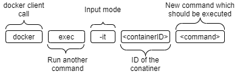

# Basic Docker commands

## Creating Container
- **docker create `imageName`** : Creates the segment with the resources for the prcoess on the harddrive (namespace and control groups)

- **docker start `containerID`** : Run the command to start the container (without an default attach)

- **docker start -a `containerID`** : Attach the output to the console 

- **docker run -d `imageName`**: Run the container in detach mode, so that it runs in the background (opposite to attach mode)

- **docker run `imageName`** : Performing a docker create and docker start to create and start a container (with an default attach (STDOUT))

- **docker run -p `<localPortNr>:<containerPortNr> <imageName>`**: Performing a docker run whit Portmapping (necessary to route incoming traffic into the container)

- **docker build .** : Build the docker Image from the `Dockerfile` in the Working Directory.

- **docker build -t `<YourDockerID>/<repo|Project name>:<version>` .** : Build and tag the image in the working directory. **Example for docker build:** `docker build -t kn0rr/redis-server:latest .` and after that start the container with `docker run kn0rr/redis-server`

> General Note: While using the containerID you could either use the whole ID `b642304fd44cf6286dca7518dd2567bca111cca39ee900d43634a88fc810e248` or  just take some characters from the beginning `b642304fd` because this should be mostly unique and docker will take the missing characters on its own 
## Inspecting Container
- **docker ps** : Showing all running containers
- **docker ps --all** : Showing all containers which has created anytime on this machine
- **docker logs** : Shows the logs of the container

## Stop Container
- **docker stop `containerID`** :  Sends a "SIGTERM" signal to the docker container to do a clean shutdown which give the processes some time to do some cleanup before shutting down (if container is not shutting down within 10 sec it is automatically falling back to docker kill command)
- **docker kill `containerID`** : Sends a "SIKILL" signal to the docker container, which shutsdown immediatly without doing cleanups.

## Executing Commands within a container
- **docker exec -it `containerID` `command`** : -i attachs the input to the STDIN channel of the container while -t is providing a prettier format in the command line tool
 

 - **docker exec -it `containerID` sh** : Starts a shell within the container, to work directly in the contianer **To get out press Ctrl+D**

 - **docker run -it `containerID` sh** : Run the shell while starting the container; Downside: Chances are that you not gonna running any other process wich are typically executed while starting the container, so its better to run the container and then do the exec command.

## Clean Up the System
- **docker system prune** : Deletes all the images and resources which have been allocated from Docker to cleanup the system 

