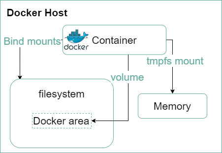
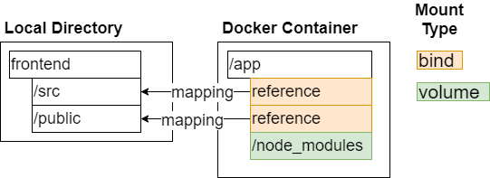
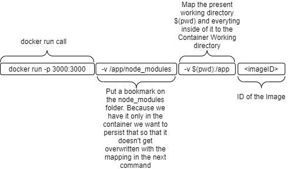
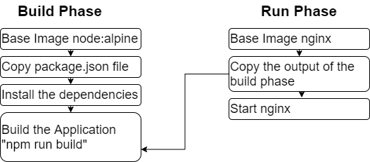

# Setting up a Project with different envioronment settings
## Development environment Setup

>Remark: The Reference Project to this documentation is the `frontend` Project

The `Dockerfile.dev` shows that this is just a dockerfile for Development purpose.
The Production Dockerfile will be called `Dockerfile` without an extension.

Build the image via 

`docker build -f Dockerfile.dev .`

### Running the container

Need to start the container in interactive mode due to some changes in create-react-library. Therefore need to run `docker run -it -p 3000:3000 <containerID>`

### Docker Volumes

With Docker Volumes you can build up a reference from your container to a folder on your machine. You differ between different types:



In our example we are using the **types** `Bind mounts` (ONLY in DEVELOPMENT Environment) and `volumes`. For further information take a look here: https://docs.docker.com/storage/



Create the reference to the local folder so that you are able to see the code changes immediatly instead of alway building a new container!

> REMARK:  `$(pwd)` is only working within a Linux environment. On Windows you can use git bash to execute this command



**Example Command for Powershell (Gitbash was not working as expected):**
````docker
docker run -it -p 3000:3000 -v /app/node_modules -v ${pwd}:/app 6a5d81a7bc1b
````

To simplify the build and run process it makes sense to use docker-compose.
The docker-compose file for this example looks like the following:

````yml
version: '3'
services:
    web:
        # To fix an issue in create-react-app while starting with docker-compose
        # Issue: https://github.com/facebook/create-react-app/issues/8688
        # Workaround: https://stackoverflow.com/questions/60790696/react-scripts-start-exiting-in-docker-foreground-cmd
        stdin_open: true
        # If there are issues with the automatical reloading of code changes
        # its possible to specify the environment variable:
        # environment:
            # - CHOKIDAR_USEPOLLING=true
        build: 
            # Specifying where we want all the files and folders to be pulled from
            # In this case its the root folder
            context: .
            # Specifying the dockerfile which should be used
            dockerfile: Dockerfile.dev
        ports:
            - "3000:3000"
        volumes:
            - /app/node_modules
            #Mapp current directory to the /app path in the container
            # Here a bind mount is used, for dynamical code changes
            - .:/app
````
## Build Tests

To execute the test in a simple way do the following steps:
1. `docker build -f Dockerfile.dev .`
2. `docker run -it 10ffbc0a69ae npm run test`

But if you want to dynamically change the test cases, you have different ways to achieve that:
1. Run the container from the development section and run the test in a second terminal within the running container:
    ````docker
    docker run -it -p 3000:3000 -v /app/node_modules -v ${pwd}:/app 6a5d81a7bc1b
    docker exec -it 6a5d81a7bc1b npm run test
    ````
    >REMARK: Only with this first approach you will be able to interact with the test in the terminal
2. Adapt the docker-compose file from above for running the test in a second container:
    ````yaml
    version: '3'
    services:
        web:
            # To fix an issue in create-react-app while starting with docker-compose
            # Issue: https://github.com/facebook/create-react-app/issues/8688
            # Workaround: https://stackoverflow.com/questions/60790696/react-scripts-start-exiting-in-docker-foreground-cmd
            stdin_open: true
            # If there are issues with the automatical reloading of code changes
            # its possible to specify the environment variable:
            # environment:
                # - CHOKIDAR_USEPOLLING=true
            build: 
                # Specifying where we want all the files and folders to be pulled from
                # In this case its the root folder
                context: .
                # Specifying the dockerfile which should be used
                dockerfile: Dockerfile.dev
            ports:
                - "3000:3000"
            volumes:
                - /app/node_modules
                #Mapp current directory to the /app path in the container.
                # Here a bind mount is used, for dynamical code changes
                - .:/app
        tests:
            build:
                context: .
                dockerfile: Dockerfile.dev
            volumes:
                - /app/node_modules
                - .:/app
            #Overwrite startup command
            command: ["npm", "run","test"]
    ````

## Build the Production Environment

We want to use nginx as the base for our production environment. The Server we used in the Development Phase is not an appropriate Prodcution Server and fulfills solely a development purpose.
To do this, we will execute multiple step to create the Production Image. 
Such a process is called **Multi Step Build Process**

### Multi Step Build Process

In our use case we will use different base Images for the **Build Phase** and **Run Phase**, so we can specify the environment which fulfills our needs in the different Lifecycle Phases of our App.

The Build Process will look like the following:




The Dockerfile will look like:

````docker
# Build Phase section

# Tag the image with the name of the build stage (in this case the builder)
# This means that everything from this "From"-Command and everything 
# underneath it will be refered as the builder Phase till we have a 
# new From statement
FROM node:alpine as builder

WORKDIR /app

COPY package.json .

RUN npm install

COPY . .

RUN npm run build

# Run Phase section

FROM nginx

# COPY the output from the "Builder"- phase and specifiy the folder which
# you want to copy and also specifying the directory where it should be copied to
# For nginx it must be a specific directory, see: https://hub.docker.com/_/nginx
COPY --from=builder /app/build /usr/share/nginx/html

# The default command of the nginx image will start nginx so we don't need to call that
````

After that run `docker build .` in the project directory and start the container with `docker run -p 8080:80 <imageID>`. After that you can access the website from http://localhost:8080.