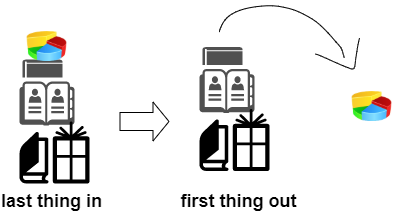
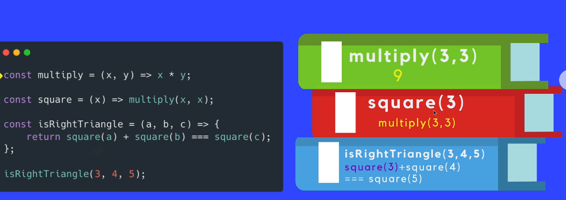
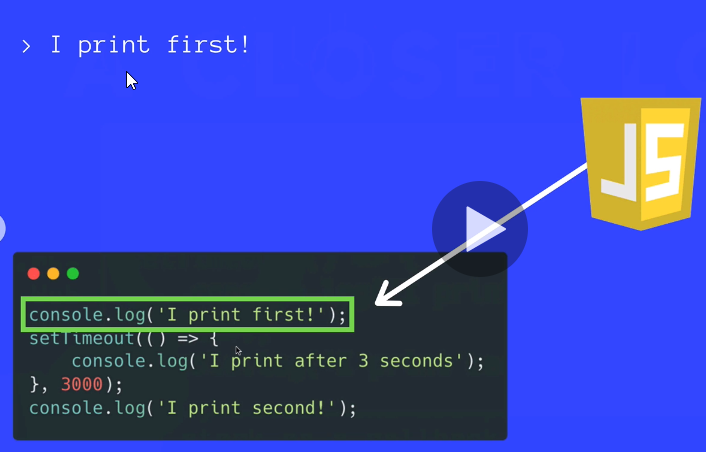
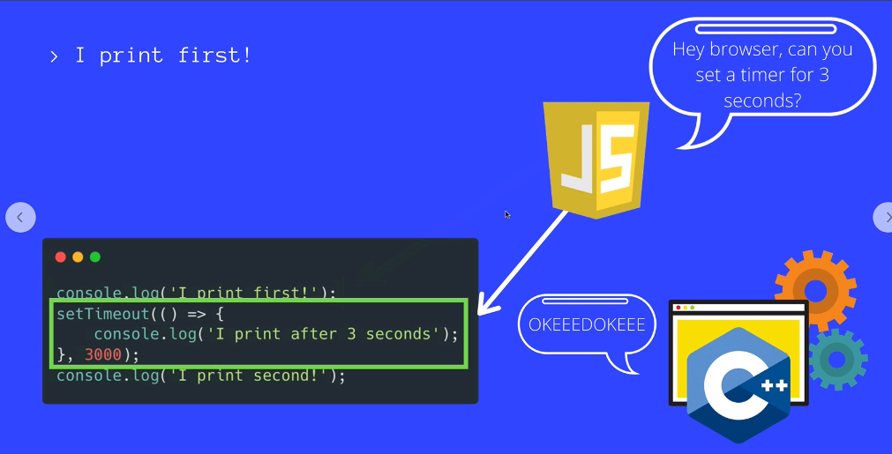
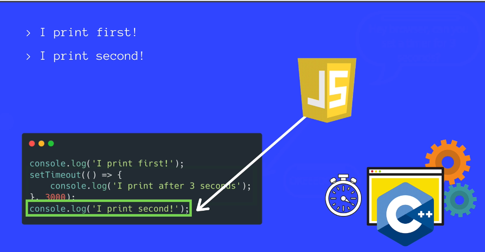
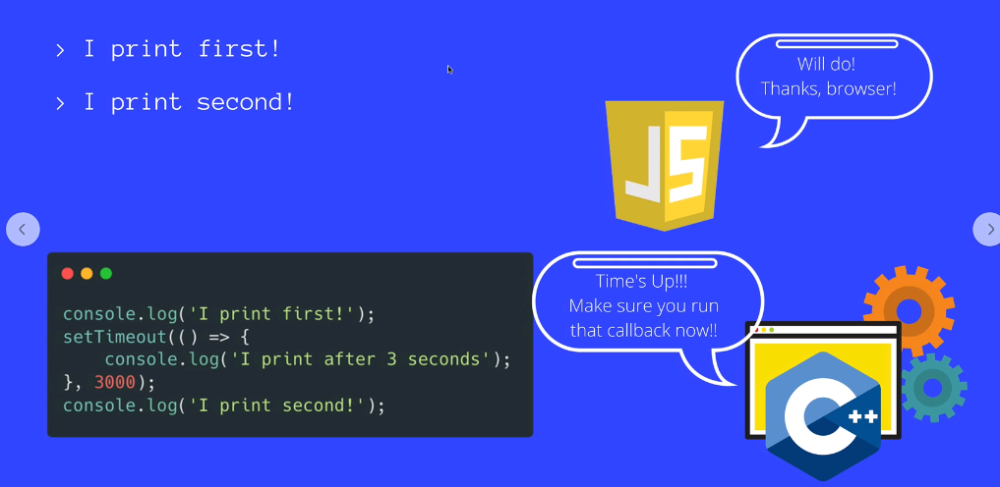
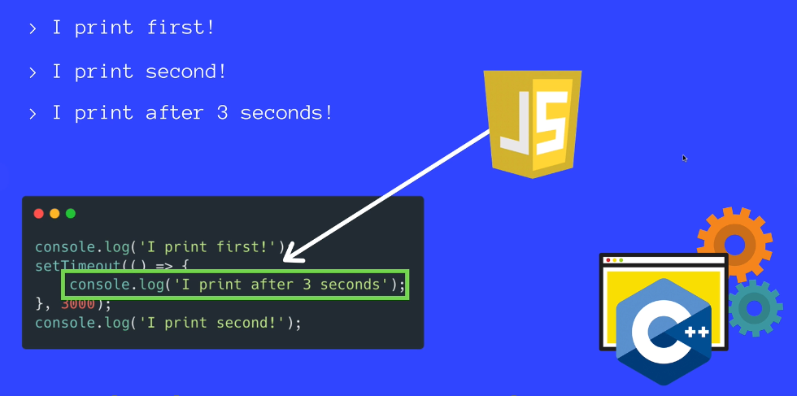

# Asynchronous Code, Callbacks & Promises

## Call Stack

The mechanism the JS interpreter uses to keep track of its place in a script that calls multiple functions.

How JS "knows" what function is currently being run and what functions are called from within that function etc.

> Example: If you read a book the "Call Stack" represents your finger which is keeping track of the line you are currently reading.

**How it works**



- When a script calls a function, the interpreter adds it to the call stack and then starts carrying out the function

- Any functions that are called by that function are added to the call stack further up, and run where their calls are reached.

- When the current function is finished, the interpreter takes it off the stack and resumes execution where it left off in the last code listing. 



## JavaScript is a Single Threaded Language

At any given point in time, that single JavaScript thread is running at most one line of JavaScript code.

## How Asynchronous Callbacks work

- Browser come with Web APIs that are able to handle certain tasks in the background /like making requests or setTimeout)

- The Js call stack recognizes these Web API functions and passes them off to the browser to take care of

- Once the browser finishes those tasks, the yretunr and are pushed onto the stack as a callback.








**Example for Callbacks where we see that it can sometimes be a real pain:**

A moving button whit a success and failure callback

````css
button {
	font-size: 50px;
}

````

````html
<!DOCTYPE html>
<html lang="en">

<head>
  <meta charset="UTF-8">
  <meta name="viewport" content="width=device-width, initial-scale=1.0">
  <meta http-equiv="X-UA-Compatible" content="ie=edge">
  <link rel="stylesheet" href="app.css">
  <title>Callback Hell</title>
</head>

<body>
  <h4>Try shrinking your window and see what happens!</h4>
  <button>Move Me!</button>
  <script src="app.js"></script>
</body>

</html>
````

````js
const btn = document.querySelector('button');

// setTimeout(()=>{
//     btn.style.transform=`translateX(100px)`;
//     setTimeout(()=>{
//         btn.style.transform=`translateX(200px)`;
//         setTimeout(()=>{
//             btn.style.transform=`translateX(100px)`;
//         },1000);
//     },1000);
// },1000);

//-> in short:

const moveX=(element,amount,delay,onSuccess,onFailure)=>{

    setTimeout(()=>{
        const bodyBoundary= document.body.clientWidth;
        const elementRight=element.getBoundingClientRect().right;
     
     const currLeft=element.getBoundingClientRect().left;
     if(elementRight+amount>bodyBoundary){
         onFailure();
     }
     else{
        element.style.transform=`translateX(${currLeft+amount}px)`;
        onSuccess();
     }
    },delay)
};

// moveX(btn, 100, 2000, () => {
//     moveX(btn, 100, 1000, () => {
//         moveX(btn, 100, 1000, () => {
//             moveX(btn, 100, 1000, () => {
//                 moveX(btn, 100, 1000)
//             })
//         })
//     })
// })

moveX(btn,100,1000,()=>{
    //success
    moveX(btn,400,1000,()=>{
         //success
    moveX(btn,800,1000,()=>{
        
    },
    //fail
    ()=>{
    alert("CAnnot move further3")
    })
    },
    //fail
    ()=>{alert("CAnnot move further1")})
}, 
//fail
()=>{
    alert("CAnnot move further2")
})
````

## Introducing to Promises

A Promise is an object representing the eventual completion or failure of an asynchronous operation.

When working with promises there are two things we need to understand:

1. How we create promises or how we create a function that returns a promise.
3. How to consume ore interact with promises.

A promise is a returned object to which you attach callbacks, instead of passing callbacks into a function.

````js
const willGetYouADog = new Promise((resolve,reject)=>{
    //resolves the promise:
    //resolve()
    //rejects the promise:
    //reject()
    const rand = Math.random();
    if (rand<0.5) resolve()
    else reject()
})
//The `Then` paramater is used to define the action which should happen, when the promise is resolved!
willGetYouADog.then(()=>{
    console.log('We got a dog')
}).catch() //.catch runs when it gets rejected

//you could also write

willGetYouADog.catch(()=>console.log('No Dog'))

````

### Returning Promises from Functions

````js
const makeDogPromise = () => {
	return new Promise((resolve, reject) => {
		setTimeout(() => {
			const rand = Math.random();
			if (rand < 0.5) {
				resolve();
			}
			else {
				reject();
			}
		}, 5000);
	});
};
makeDogPromise()
	.then(() => {
		console.log('YAY WE GOT A DOG!!!!');
	})
	.catch(() => {
		console.log(':( NO DOG');
	});


````

### Resolving/Rejecting with Values

````js
//This is a FAKE Http Request Function
//It takes 1 second to resolve or reject the promise, depending on the url that is passed in
const fakeRequest = (url) => {
	return new Promise((resolve, reject) => {
		setTimeout(() => {
			const pages = {
				'/users' : [
					{ id: 1, username: 'Bilbo' },
					{ id: 5, username: 'Esmerelda' }
				],
				'/about' : 'This is the about page!'
			};
			const data = pages[url];
			if (data) {
				resolve({ status: 200, data }); //resolve with a value!
			}
			else {
				reject({ status: 404 }); //reject with a value!
			}
		}, 1000);
	});
};
//this should resolve
fakeRequest('/users')
	.then((res) => {
		console.log('Status Code', res.status);
		console.log('Data', res.data);
		console.log('REQUEST WORKED!');
	})
	.catch((res) => {
		console.log(res.status);
		console.log('REQUEST FAILED');
	});
//THIS should reject
fakeRequest('/dogs')
	.then((res) => {
		console.log('Status Code', res.status);
		console.log('Data', res.data);
		console.log('REQUEST WORKED!');
	})
	.catch((res) => {
		console.log(res.status);
		console.log('REQUEST FAILED');
	});
````

### Promise Chaining

````js
//This is a FAKE Http Request Function
//It takes 1 second to resolve or reject the promise, depending on the url that is passed in
const fakeRequest = (url) => {
	return new Promise((resolve, reject) => {
		setTimeout(() => {
			const pages = {
				'/users'        : [
					{ id: 1, username: 'Bilbo' },
					{ id: 5, username: 'Esmerelda' }
				],
				'/users/1'      : {
					id        : 1,
					username  : 'Bilbo',
					upvotes   : 360,
					city      : 'Lisbon',
					topPostId : 454321
				},
				'/users/5'      : {
					id       : 5,
					username : 'Esmerelda',
					upvotes  : 571,
					city     : 'Honolulu'
				},
				'/posts/454321' : {
					id    : 454321,
					title :
						'Ladies & Gentlemen, may I introduce my pet pig, Hamlet'
				},
				'/about'        : 'This is the about page!'
			};
			const data = pages[url];
			if (data) {
				resolve({ status: 200, data }); //resolve with a value!
			}
			else {
				reject({ status: 404 }); //reject with a value!
			}
		}, 1000);
	});
};

fakeRequest('/users')
	.then((res) => {
		console.log(res);
		const id = res.data[0].id;
        //take output from request and make new request
		return fakeRequest(`/users/${id}`);
	})
	.then((res) => {
		console.log(res);
		const postId = res.data.topPostId;
		return fakeRequest(`/posts/${postId}`);
	})
	.then((res) => {
		console.log(res);
	})
	.catch((err) => {
		console.log('OH NO!', err);
	});

// ************************************************
// ATTEMPT 2 (deliberate error to illustrate CATCH)
// ************************************************
// fakeRequest('/users')
// 	.then((res) => {
// 		console.log(res);
// 		const id = res.data[0].id;
// 		return fakeRequest(`/useALSKDJrs/${id}`); //INVALID URL, CATCH WILL RUN!
// 	})
// 	.then((res) => {
// 		console.log(res);
// 		const postId = res.data.topPostId;
// 		return fakeRequest(`/posts/${postId}`);
// 	})
// 	.then((res) => {
// 		console.log(res);
// 	})
// 	.catch((err) => {
// 		console.log('OH NO!', err);
// 	});

````

### Refactoring Callback example with Promises

````css
button {
	font-size: 50px;
}

````

````html
<!DOCTYPE html>
<html lang="en">

<head>
  <meta charset="UTF-8">
  <meta name="viewport" content="width=device-width, initial-scale=1.0">
  <meta http-equiv="X-UA-Compatible" content="ie=edge">
  <link rel="stylesheet" href="app.css">
  <title>Refactoring With Promises</title>
</head>

<body>
  <h4>Try shrinking your window and see what happens!</h4>
  <button>Move Me!</button>
  <script src="app.js"></script>
</body>

</html>
````

````js
const moveX = (element, amount, delay) => {
	return new Promise((resolve, reject) => {
		setTimeout(() => {
			const bodyBoundary = document.body.clientWidth;
			const elRight = element.getBoundingClientRect().right;
			const currLeft = element.getBoundingClientRect().left;
			if (elRight + amount > bodyBoundary) {
				reject({ bodyBoundary, elRight, amount });
			}
			else {
				element.style.transform = `translateX(${currLeft + amount}px)`;
				resolve();
			}
		}, delay);
	});
};

const btn = document.querySelector('button');
moveX(btn, 100, 1000)
	.then(() => moveX(btn, 100, 1000))
	.then(() => moveX(btn, 100, 1000))
	.then(() => moveX(btn, 100, 1000))
	.then(() => moveX(btn, 100, 1000))
	.then(() => moveX(btn, 100, 1000))
	.then(() => moveX(btn, 100, 1000))
	.then(() => moveX(btn, 100, 1000))
	.then(() => moveX(btn, 100, 1000))
	.then(() => moveX(btn, 100, 1000))
	.then(() => moveX(btn, 100, 1000))
	.then(() => moveX(btn, 100, 1000))
	.then(() => moveX(btn, 100, 1000))
	.then(() => moveX(btn, 100, 1000))
	.then(() => moveX(btn, 100, 1000))
	.then(() => moveX(btn, 100, 1000))
	.catch(({ bodyBoundary, amount, elRight }) => {
		console.log(`Cannot Move! Body is ${bodyBoundary}px wide`);
		console.log(`Element is at ${elRight}px, ${amount}px is too large!`);
	});

//This function moves an element "amount" number of pixels after a delay.
//If the element will stay on screen, we move the element and call the onSuccess callback function
//If the element will move off screen, we do not move the element and instead call the onFailure callback
// const moveX = (element, amount, delay, onSuccess, onFailure) => {
// 	setTimeout(() => {
// 		const bodyBoundary = document.body.clientWidth;
// 		const elRight = element.getBoundingClientRect().right;
// 		const currLeft = element.getBoundingClientRect().left;
// 		if (elRight + amount > bodyBoundary) {
// 			onFailure();
// 		}
// 		else {
// 			element.style.transform = `translateX(${currLeft + amount}px)`;
// 			onSuccess();
// 		}
// 	}, delay);
// };

// LOOK AT THIS UGLY MESS!
// moveX(
// 	btn,
// 	300,
// 	1000,
// 	() => {
// 		//success callback
// 		moveX(
// 			btn,
// 			300,
// 			1000,
// 			() => {
// 				//success callback
// 				moveX(
// 					btn,
// 					300,
// 					1000,
// 					() => {
// 						//success callback
// 						moveX(
// 							btn,
// 							300,
// 							1000,
// 							() => {
// 								//success callback
// 								moveX(
// 									btn,
// 									300,
// 									1000,
// 									() => {
// 										//success callback
// 										alert('YOU HAVE A WIDE SCREEN!');
// 									},
// 									() => {
// 										//failure callback
// 										alert('CANNOT MOVE FURTHER!');
// 									}
// 								);
// 							},
// 							() => {
// 								//failure callback
// 								alert('CANNOT MOVE FURTHER!');
// 							}
// 						);
// 					},
// 					() => {
// 						//failure callback
// 						alert('CANNOT MOVE FURTHER!');
// 					}
// 				);
// 			},
// 			() => {
// 				//failure callback
// 				alert('CANNOT MOVE FURTHER!');
// 			}
// 		);
// 	},
// 	() => {
// 		//failure callback
// 		alert('CANNOT MOVE FURTHER!');
// 	}
// );

````