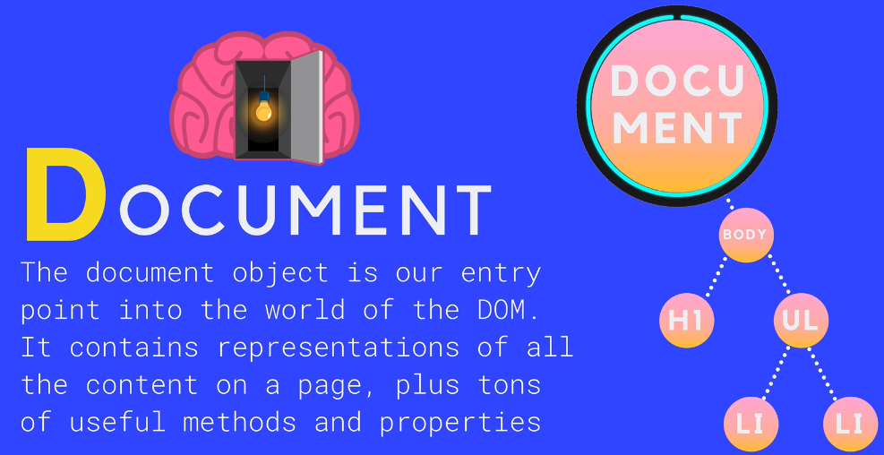

# DOM (Document Object Model)

- The DOM is a JavaScript representation of a webpage
- It's your JS "window" into the contents of a webpage
- It's just a bunch of objects that you can interact with via JS


````js
// Go to Google.de
// Select any ID
// Go to Consol
document.getElementById('gbqfbb')
//<input id="gbqfbb" value="Auf gut Glück!" aria-label="Auf gut Glück!" name="btnI" type="submit" data-ved="0ahUKEwjR9YCJ7rTtAhUE3xoKHdRbBfQQnRsIDg">

//OR
document.querySelector("gbqfbb")

const btnObj = document.querySelector("gbqfbb")
console.dir(btnObj)
/*
input#gbqfbb
accept: ""
accessKey: ""
align: ""
alt: ""
ariaAtomic: null
ariaAutoComplete: null
ariaBusy: null
ariaChecked: null
ariaColCount: null
ariaColIndex: null
ariaColSpan: null
ariaCurrent: null
more and more and more.....
*/

//you can change the value:
btnObj.value='I Am Really Lucky'
//or
btnObj.addEventListener('mouseover',function(){alert("Hi")})

//More manipulation
// create a Snippet in Chrome via Sources -> Snippets ->New snippet and run the snippet
const myImg= document.createElement('img');
myImg.src="https://images.unsplash.com/photo-1520828399171-5c4e25963afc?ixid=MXwxMjA3fDB8MHxwaG90by1wYWdlfHx8fGVufDB8fHw%3D&ixlib=rb-1.2.1&auto=format&fit=crop&w=2118&q=80"
myImg.style.width='300px'
document.body.append(myImg)
myImg.style.transition='all 2s';

const allElse=document.body.children
const sheet= new CSSStyleSheet();
sheet.replaceSync('*{transition: all 2s}');
document.adoptedStyleSheets=[sheet];

setInterval(()=>{
    for (let el of allElse){
        const rotation=Math.floor(Math.random()*360)
         const x=Math.floor(document.body.clientWidth*Math.random())
    const y=Math.floor(document.body.clientHeight*Math.random())
        el.style.transform=`translate(${x}px,${y}px) rotate(${rotation}deg)`
    }
  
    //myImg.style.transform=`translate(${x}px,${y}px)`
},2000)
````

## Document

The document object is our entry point into the world of the DOM. It contains representations of all the content on a page, plus tons of useful methods and properties.



````js
// in every single browser window the document exists just type document to take a look
document
console.dir(document)
/*
#document
URL: "https://www.google.de/search?sxsrf=ALeKk008yHHkI0as05Gi8OUYoFmAhpu-gg%3A1607106954954&ei=ioHKX6XmOaqblwSeloWACw&q=console.dir%28document%29&oq=console.dir%28document%29&gs_lcp=CgZwc3ktYWIQAzIECCMQJzIFCAAQywE6BAgAEEdQlKgFWNupBWDdrQVoAHADeACAAU2IAYgBkgEBMpgBAKABAaoBB2d3cy13aXrIAQjAAQE&sclient=psy-ab&ved=0ahUKEwil06n5-7TtAhWqzYUKHR5LAbAQ4dUDCA0&uact=5"
activeElement: body#gsr.srp.vasq
adoptedStyleSheets: []
alinkColor: ""
more....
*/

````
