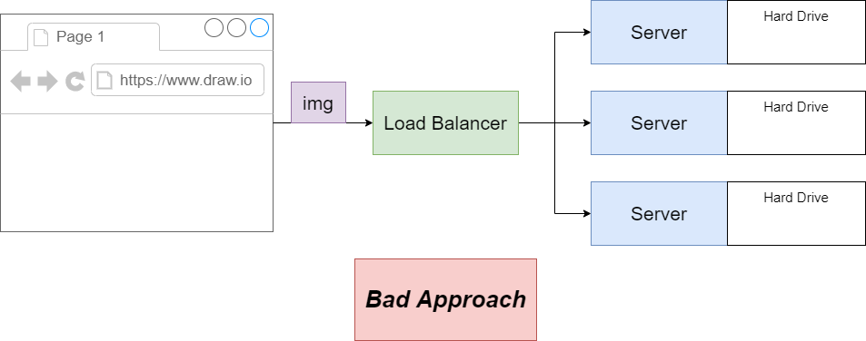
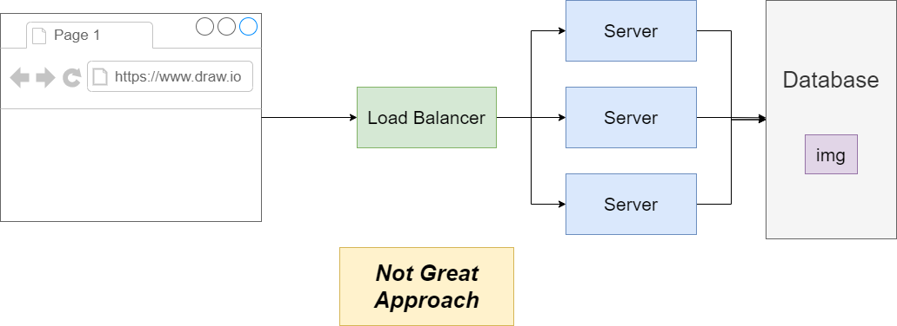
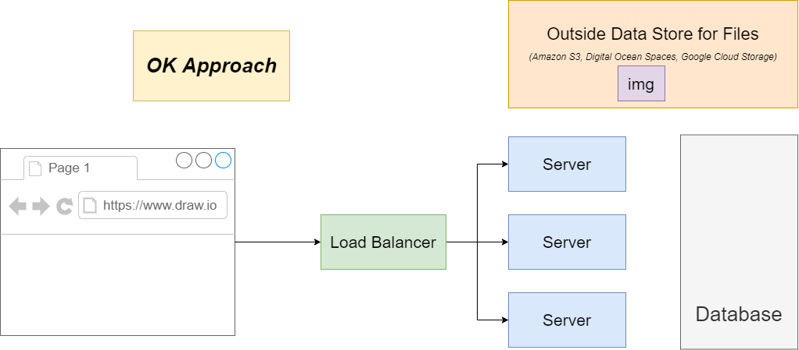
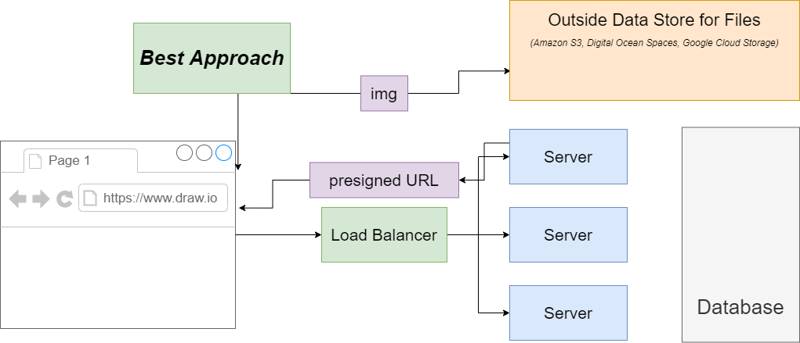

# Different Methods of Storing Images

## Storing Images on the Harddrive of each Server

## Storing Images on the Database

## Storing Images an outside Datastore with a reference on the DB

## Storing Images on an outside Datastore and use presigned URL

