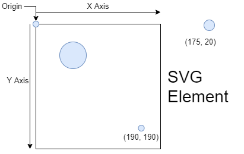
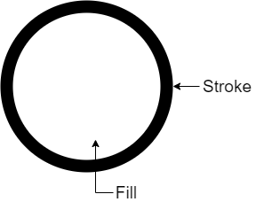
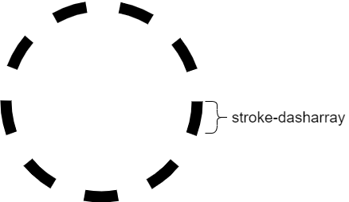
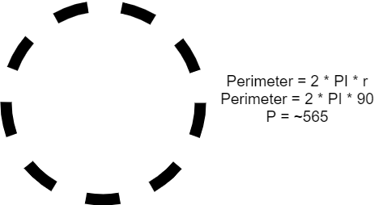
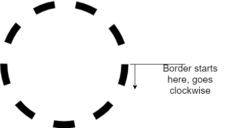
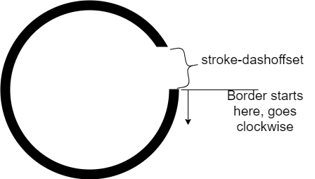
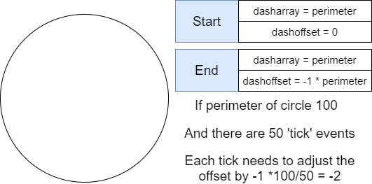
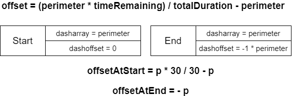

# Scalabel Vector Graphics (HTML-Element)

It is similar to a canvas and we can draw as much as we are want to.

Everything starts from the origin and the x and y achses are build up based on the origin.

Every element within the svg musta have a value within the svg.



We could draw different elements within the svg:
- circle
- rectangle
- path
- ..

````html
<svg height="200" width="200">
    <circle r="20" cx="30" cy="30"/>
</svg>
````

# Circle 
Draw a circle which will be counted down based on a set timer

The fill is inside of the circle, while the stroke is the line



````html
<svg height="200" width="200">
    <circle 
        r="20" 
        cx="30" 
        cy="30"
        fill="red"
        stroke="blue"
        stroke-width="10"
        />
</svg>
````


The dash splits the stroke into the size of the defined pixels.
First value is the lenght of the dash, second one is the length of the gap. 
You can also specify only one then the length of the dash and gap will be the same.

````html
<svg height="200" width="200">
    <circle 
        r="20" 
        cx="30" 
        cy="30"
        fill="red"
        stroke="blue"
        stroke-width="10"
        stroke-dasharray="10"
        />
    <circle 
        r="20" 
        cx="30" 
        cy="130"
        fill="red"
        stroke="blue"
        stroke-width="10"
        stroke-dasharray="10 5"
        />
</svg>
````




The Dash-offset gives a space at the end of the circle.
````html
<svg height="200" width="200">
    <circle 
        r="20" 
        cx="30" 
        cy="30"
        fill="red"
        stroke="blue"
        stroke-width="10"
        stroke-dasharray="10"
        stroke-dashoffset="10"
        />

</svg>
````

