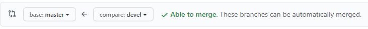

# Basics of Kubernetes

## Basic Infrastructure


## Transfer Knowledge

We used for docker-compose and the deployment to AWS a config file to describe what we want to do. The same applies for Kubernetes.


So to transfer the knowledge we have from the docker-compose file take a look at the following:


In the picture you see that in case of Kuberentes we are talking about **objects**. 

## Kubernetes Objects and API Versions


In Kubernetes there exists different kinds of Objects which we want to create through our config-files.

Usage of differenet types:


 - **Pod**: A Pod is used for running a container
 - **Services**: Setting up some networking 
 - **Deployment**: Maintains a set of identical pods, ensuring that they have the correct config and that the right number exists

### Pod in Detail:


### Deployment in Detail:


 
### Services in Detail:


### Secret in Detail:

We need to make sure to create the Secret manually in every environment, because it is a imperative command we are going to use.

There exists three secret types:
- **generic**: Indicates that we are saving some arbitrary number of key-value pairs together
- **docker-registry**: Set up some type of authentication with a custom docker registry
- **tls**: to store a set off tls keys

````docker
kubectl create secret generic <secret_name> --from-literal key=value

# Example:
kubectl create secret generic pgpassword --from-literal PGPASSWORD=password123
````

### API Concept

 In Kubernetes the API version defines a different set of Objects which can be used, so its necessary to know which Object you want to create to specify the API Version:

 

## Commands


## Deployment flow


## Takeaways


## Imperative vs Declarative


## Update an Object Declarative


## How to update an Image Version


We war using the last option with an imperative command.

We need to do the following:

1. Build the new image
2. Push the new image
3. Set new image via imperative command

````docker
docker build -t kn0rr/multi-docker-client:v5 .
docker push kn0rr/multi-docker-client:v5
kubectl set image deployment/client-deployment client=kn0rr/multi-docker-client:v5
````

## Combine two config files into one

````yml
# you can combine confige files and put them together with an ---
apiVersion: apps/v1
kind: Deployment
metadata:
    name: server-deployment
spec:
    replicas: 3
    selector:
        matchLabels:
            component: server
    template:
        metadata:
            labels:
                component: server
        spec:
            containers:
                - name: server
                  image: kn0rr/multi-k8s-server
                  ports:
                    - containerPort: 5000
---
    apiVersion: v1
    kind: Service
    metadata:
        name: server-cluster-ip-Service
    spec:
        type: ClusterIP
        selector: 
            component: server
        ports:
            - port: 5000
              targetPort: 5000

````

# Mulit-Container App with Kubernetes

## Architecture


### Storage Issues


### K8s Volumes

There exists 3 Types of "Volumes" which Kubernetes is aware of:
1. Volumes: Storage tied to the POD. 

2. Persistent Volumes: Storage outside of the Pod
 
3. Persistent Volume  Claims: It is not a actual instance of Storage instead it is something we attach to a pod config. Kubernetes is trying to find a statical or dynamical provisioned Perstistent volume to meet the requirement of this claim.


### Persistent Volume Claims

It is not a actual instance of Storage instead it is something we attach to a pod config. Kubernetes is trying to find a statical or dynamical provisioned Perstistent volume to meet the requirement of this claim.

````yaml
apiVersion: v1
kind: PersistentVolumeClaim
metadata:
    name: database-persistent-volume-claim
spec:
    accessModes:
        - ReadWriteOnce
    resources:
        requests:
            storage: 2Gi
````

#### Access Modes

 1. ReadWriteOnce: Can be used by a **single node**

 2. ReadOnlyMany: **Multiple nodes** can **read** from this

 3. ReadWriteMany: Can be **read and written** to by **many nodes**

#### Storage Class Options

An overview of possible Storage class options can be found here:
https://kubernetes.io/docs/concepts/storage/storage-classes/

## Setting up Ingress

Link to the documentation: https://kubernetes.github.io/ingress-nginx/deploy/#provider-specific-steps

We need to first run for Docker Desktop :

````docker
kubectl apply -f https://raw.githubusercontent.com/kubernetes/ingress-nginx/controller-v0.41.2/deploy/static/provider/cloud/deploy.yaml
````

### Setting up Kubernetes Dashboard

File was downloaded from: https://github.com/kubernetes/dashboard

via (on Gitbash): 

````docker
curl -O https://raw.githubusercontent.com/kubernetes/dashboard/v2.0.4/aio/deploy/recommended.yaml
````

and than applied to cluster

````docker
kubectl apply -f recommended.yaml
````

and then started via:

````docker
kubectl proxy
````

it can than be accessed via: http://localhost:8001/api/v1/namespaces/kubernetes-dashboard/services/https:kubernetes-dashboard:/proxy/

## Starting with Google Deployment

### Architecture on Google:


### Setting up Travis for Google

Overview:


Get Travis to work with Google:


Install Travis CLI on Docker to work with it


````docker
docker run -it -v %cd%:/app ruby:2.4 sh
````

> %cd% is the same as $(pwd) on linux side and prints the working directory which is used as the volume for the container

In the upcoming shell follow the next steps:

``````sh
gem install travis
travis login --com --github-token <github-token> --debug --explode
travis encrypt-file --com service-account.json -r kn0rr/multi-k8s
``````

After the encryption copy the openssl line into the `.travis.yml` file in the before install section.

**Delete the service-account.json -> THIS IS REALLY IMPORTANT**

> Can run the same on windows after installing travis-cli via chocolatey

Add additional configuration for google in the .travis.yml file, at the end it should look like this:
````sh
sudo: required
services:
    - docker
before_install:
    - openssl aes-256-cbc -K $encrypted_9f3b5599b056_key -iv $encrypted_9f3b5599b056_iv -in service-account.json.enc -out service-account.json -d
    - curl https://sdk.cloud.google.com | bash >/dev/null;
    - source $HOME/google-cloud-sdk/path.bash.inc
    - gcloud components update kubectl
    - gcloud auth activate-service-account --key-file service-account.json
    - glcoud config set project multi-k8s-295615
    - gcloud config set compute/zone europe-west1-b
    - gcloud container clusters get-credentials multi-cluster
 ````

 Next step you should add login configuration to Docker Hub:

 1. Add follwoing to the `.travis.yml` -File in before_install:
    ````sh
        - echo "$DOCKER_PASSWORD" | docker login -u "$DOCKER_USERNAME" --password-stdin
    ````

 2. Add `$DOCKER_PASSWORD` and `$DOCKER_USERNAME` to the Environment Variable at the Travis-Cli Repo


 Next steps:
 1. build test container
 
 2. Run the Test
 
 3. Add deploy section where we define a script which will do the Docker builds for the production stuff
 
 4. Add deploy.sh into project root path and add the build commands in deploy.sh
    - We will tag the images with latest (This is useful for other developers which want to use our project so they can use the `latest`- image instead of the SHA value) and with an unique identifier where we use the Git SHA, so that we can easily identify if the image has changed over time
    - To enable this we need to make the GIT SHA available as an environment variable in the `.travis.yml` file
 
 The finished ``deploy.sh` looks as following:

 ````sh
 docker build -t kn0rr/multi-k8s-client:latest -t kn0rr/multi-k8s-client:$SHA -f ./client/Dockerfile ./client
docker build -t kn0rr/multi-k8s-server:latest -t kn0rr/multi-k8s-server:$SHA -f ./server/Dockerfile ./server
docker build -t kn0rr/multi-k8s-worker:latest -t kn0rr/multi-k8s-worker:$SHA -f ./worker/Dockerfile ./worker
docker push kn0rr/multi-k8s-client:latest
docker push kn0rr/multi-k8s-client:$SHA
docker push kn0rr/multi-k8s-server:latest
docker push kn0rr/multi-k8s-server:$SHA
docker push kn0rr/multi-k8s-worker:latest
docker push kn0rr/multi-k8s-worker:$SHA
kubectl apply -f k8s
kubectl set image deployments/server-deployment server= kn0rr/multi-k8s-server:$SHA
kubectl set image deployments/server-deployment client= kn0rr/multi-k8s-client:$SHA
kubectl set image deployments/server-deployment worker= kn0rr/multi-k8s-worker:$SHA
 ````

The finished `.travis.yml`-file looks like:

 ````sh
sudo: required
services:
    - docker
# Define GIT SHA as global variable to tag our images later with this version
# Cloud...: Make sure that it not show any prompts because we cannot handle this in an CI/CD environment
env:
    global:
        - SHA=$(git rev-parse HEAD)
        - CLOUDSDK_CORE_DISABLE_PROMPTS=1
before_install:
    - openssl aes-256-cbc -K $encrypted_9f3b5599b056_key -iv $encrypted_9f3b5599b056_iv -in service-account.json.enc -out service-account.json -d
    - curl https://sdk.cloud.google.com | bash >/dev/null;
    - source $HOME/google-cloud-sdk/path.bash.inc
    - gcloud components update kubectl
    - gcloud auth activate-service-account --key-file service-account.json
    - glcoud config set project multi-k8s-295615
    - gcloud config set compute/zone europe-west1-b
    - gcloud container clusters get-credentials multi-cluster
    - echo "$DOCKER_PASSWORD" | docker login -u "$DOCKER_USERNAME" --password-stdin
    - docker build -t kn0rr/react-test -f ./client/Dockerfile.dev ./client
script:
    - docker run -e CI=true kn0rr/react-test npm test

deploy:
    provider: script
    script: bash ./deploy.sh
    on:
        branch: master
 ````

We still need to do some changes on Google Cloud: 

1. Add PGPASSWORD secret to Goolge Cloud via:
    - Enable Cloud shell on the top right at Google Cloud
    - Run following commands:
        ````sh
        gcloud config set project multi-k8s-295615
        gcloud config set compute/zone europe-west1-b
        gcloud container clusters get-credentials multi-cluster
        kubectl create secret generic pgpassword --from-literal PGPASSWORD=<password>
        ````
2. Add Helm ([DOC](https://helm.sh/docs/helm/)) v3 to GoogleCloud:
    ````sh
    curl -fsSL -o get_helm.sh https://raw.githubusercontent.com/helm/helm/master/scripts/get-helm-3
    chmod 700 get_helm.sh
    ./get_helm.sh
    ````
3. Install ingress-nginx with Helm :
    ````sh
    helm repo add ingress-nginx https://kubernetes.github.io/ingress-nginx
    helm install my-release ingress-nginx/ingress-nginx
    ````

And then we can push our code to github and travis will build our project.

## Example of doing changes to the project

We will follow this workflow: 


1. Checkout Branch:
    ````git
    git checkout -b devel
    ````

2. Make changes in Client e. g. changes in App.js naming of Link

3. Push Branch
    ````git
    git add .
    git commit -m "Change App.js Link name"
    git push origin devel
    ````
4. Go to Github->To the Project-> Pull requests-> Create pull request -> Compare devel with master-> Create Pull Request
    

5. Travis will test the branch 

6. After complete and succesfull testing we can merge the branches (and delete it aftwards if we want)
