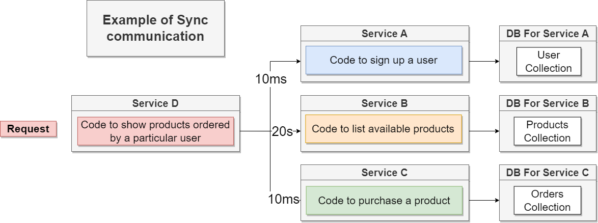

# What is a Microservice?

A monolithic architecture looks similar like this:

A Monolith normally contains following functions to implement **all features** of our app:

- Routing
- Middlewares
- Business Logic
- Database access

In contrast a Microservice contains all these functions to implement **one feature!**

So a Microservice Architecture might look like this:

Every feature has is own personalized service and they are totally self-contained. So even if one features crashes, the other features are still working.

# Data Management between services

The Data Management is **THE** big problem of microservices, because we want to produce self-contained services there exists some restrictions regarding database access.

**Why Databse-Per-Service is necessary**

- We want each service to run independently of other services
- Database schema/structure might change unexpectedly (if different teams work on different Microservices)
- Some services might function more efficiently with different types of DB's (sql vs nosql)

# Communication Strategy between Services 

We use two different strategies to communicate between different Microservices.

## Synchronous Communication

A possible example how synchronous communication may work in a mciroservice environement:

This leads to the following Pro's and Con's of Synchronous Communication:

The more a Microservice needs to communicate to other Services the more complex the whole architecture might become:

## Asynchronous Communication

There exists two different ways of asyncronous communcation.

**First Way: Event-Based Communication**

The event-based communication is not a good way for communication because it shares all the downsides of synchronous communcation and has additional downsides (like enhanced complexity).

**Second Way: Event-Based Enhanced**

First of all specify what exactly is necessary for each service to provide the functionality, for example: 

Then you can use the event-based communication to get changed data into your individual services: 

In this way you make sure, that Service D always has the right data to show the ordered products for each user without relying on other services during the execution of Service D.

