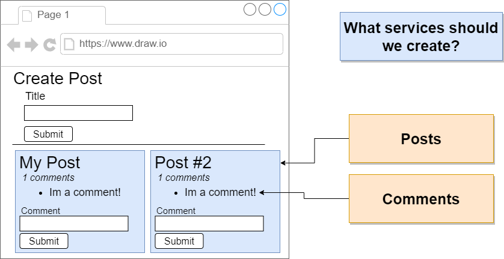
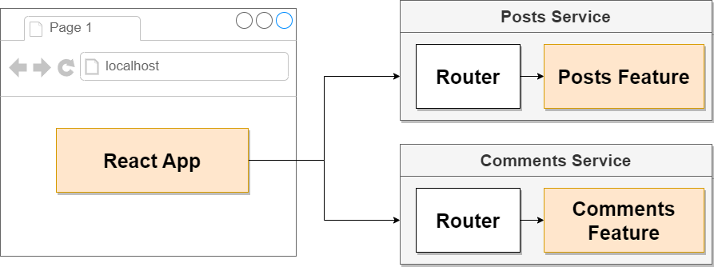
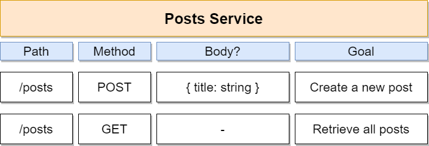
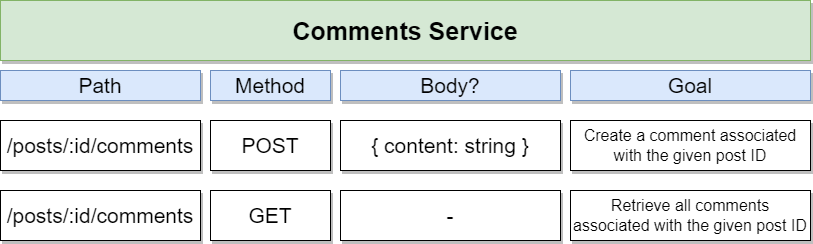

# Build an App from Scratch



The App has two different Services with two functionalities:

- Posts:
    - Create a Post
    - List all Posts
- Comments
    - Create a Comment
    - List all comments

There will be necessary information which needs to be shared between these two Services which will be a practice for Service Communication.

## Architecture

**Initial Setup**

- Generate a new React App using Create-React-App 
    ````js
    npx create-react-app client
    npm install axios
    ````
- Create an Express-based project for the Posts Service 
    ````js
    npm init -y // initalize json file
    npm install express cors axios nodemon // install packages
    npm install cors // necessary to prevent CORS issue for requests
    ````
- Create an Express-based project for the Comments Service
    ````js
    npm init -y // initalize json file
    npm install express cors axios nodemon // install packages
    npm install cors // necessary to prevent CORS issue for requests
    ````

**Overall Architecture:**



**Posts Service:**



**Comments Service:**


