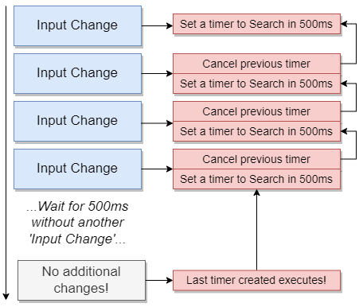

# Axios vs Fetch

React itself is only a library to showing content or html to the user and handling User interaction.
To handle network request we need something else.


There exists some different ways to handle that.

Two of them are:

1. **Axios:** Third party library
2. **Fetch:** Function built into modern browsers

Axios covers most of the basic implementation in fetch and delivers us a convenient way to handle requests.

We need to install axios in our project:

````js
npm install --save axios
//or
yarn add axios
````

After that you can work with axios:

````js
//Example request to unsplash
async getResults(<search parameter>){
    const response = await axios.get('https://api.unsplash.com/search/photos',{
            params:{query: <search parameter>},
            headers: {
                Authorization: 'Client-ID: <Client ID>'
            }
    });
    
    console.log(response.data.results);
}
````

## API for Search Function

If you use an API for Search purpose you need to set up a way to delay the API call so that there is no API call while the user is still typing.



`Example:` An App that searches for a search Term within the Wikipedia Database and gives a list as a result back.
````js

//Search.js
import React, {useState, useEffect} from 'react';
import axios from 'axios';
import { result } from 'lodash';


const Search =() =>{
    const [term,setTerm]=useState('');
    const [results, setResults]= useState([]);

    useEffect(()=>{
        const search = async ()=>{
           const {data}= await axios.get('https://en.wikipedia.org/w/api.php', {
                params: {
                    action: 'query',
                    list: 'search',
                    format: 'json',
                    origin: '*',
                    srsearch: term
                }
            });
            setResults(data.query.search);
        }
        if (term){
        search();
            }
    }, [term])

    const renderedResults = results.map((result)=>{
        //dangerouslySetInnerHTML: Allows execution of HTML Code within your app therefore use carefully because of XSS attack!
        return (
        <div key={result.pageid} className="item">
            <div className="right floated content">
                <a className="ui button" href={`https://en.wikipedia.org?curid=${result.pageid}`}>Go</a>
            </div>
            <div className="content">
                <div className="header">
                    {result.title}
                 </div>
                <span dangerouslySetInnerHTML={{ __html: result.snippet}}></span>
            </div>
            
        </div>
        );
    })
    
    return (
        <div>
            <div className="ui form">
                <div className="field">
                    <label> Enter Search Term</label>
                    <input 
                    className="input"
                    value= {term}
                    onChange={(e) => setTerm(e.target.value)}
                     />
                </div>
            </div>
            <div className="ui celled list">
                {renderedResults}
            </div>
        </div>
        )
};


export default Search;


// App.js
import React from 'react';

import Search from './components/Search';

export default () =>{
    return (
        <div>
            <Search/>
        </div>
    );
};
````