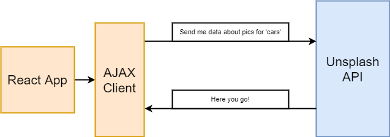

# Axios vs Fetch

React itself is only a library to showing content or html to the user and handling User interaction.
To handle network request we need something else.



There exists some different ways to handle that.

Two of them are:

1. **Axios:** Third party library
2. **Fetch:** Function built into modern browsers

Axios covers most of the basic implementation in fetch and delivers us a convenient way to handle requests.

We need to install axios in our project:

````js
npm install --save axios
//or
yarn add axios
````

After that you can work with axios:

````js
//Example request to unsplash
async getResults(<search parameter>){
    const response = await axios.get('https://api.unsplash.com/search/photos',{
            params:{query: <search parameter>},
            headers: {
                Authorization: 'Client-ID: <Client ID>'
            }
    });
    
    console.log(response.data.results);
}
````
