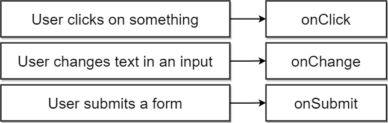

# React Events

There are different types of event in most cases we want to handle events when user interacts with an element.

These three events events are commonly used:



Example:

````js
class SearchBar extends React.Component {
   onInputChange(event){
    console.log(event.target.value);
   }
   
    render() {
        return (
        <div className="ui segment">
            <form className="ui form">
                <div className="field">
                    <label>Image Search</label>
                    <input type ="text" onChange={this.onInputChange}/>
                </div>
            </form>
        </div>)
    }
}
// alternative
class SearchBar extends React.Component {   
    render() {
        return (
        <div className="ui segment">
            <form className="ui form">
                <div className="field">
                    <label>Image Search</label>
                    <input type ="text" onChange={(e)=>console.log(e.target.value)}/>
                </div>
            </form>
        </div>)
    }
}

````
