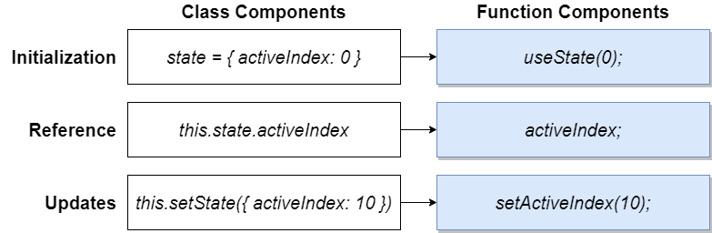
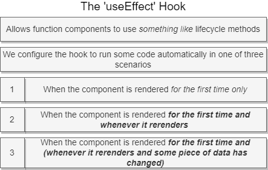

# Hooks System 


White the hook system we get a coolection of different functions, we will call it primitive hooks. There exists ten functions which allow us to give more functionality to functional components.

A `custom hook` is a peace of code that does one very repeatable or task, little chunk of code that we want to make as reusable as possible inside of a custom hook. e.g. a custom hook useTranslate  which uses useState and useEffect hooks.


## useState

````js
//Implementation:
const [activeIndex, setActiveIndex]=useState(null)
````

`useState` makes use of Array destructering by assigning the first value of the useSate array to activeIndex and the second value to setActiveIndex.

activeIndex: A reference to some variable that changes overtime and we want to keep track on

setActiveIndex: a variable that refers to a function that updates our state and causes the entire component to autmatically rerender.


**Comparison of State between Class and Function Component**



Implement multiple states:


## useEffect



The `useEffect` Hook consist of two arguments. The first argument is always a function (can be a normal function or an arrow function). The method in the function will then be automatically executed at some point in time. The second argument controlls when this function gets executed. It can be either an empty array, an array with some values in side of it or no array at all.

````js
//Implementation:

// Empty Array: Run at initial render
useEffect(()=>{

}, []) 

// Arrawy with element: Run at initial render and Run after every rerender if data has changed since last render 
useEffect(()=>{

}, [term])
// or
useEffect(()=>{

}, [term, term2]) // everytime one of the two or both changes

// nothing: Run at initial render and Run after every rerender
useEffect(()=>{

})
````
`Hint:` UseEffect can not have an ASYNC function as first argument, but you can do something like this

````js
useEffect(()=>{
    const search= async()=>{
        await axios.get('test');
    };
    search();
},[term]);

// or without extra variable (it still does the same as above)

useEffect(()=>{
    (async()=>{
        await axios.get('test');
    })();
},[term]);

// or use promises

useEffect(()=>{
    axios.get('test')
        .then(()=>{
            console.log(response.data);
        });

},[term]);

````