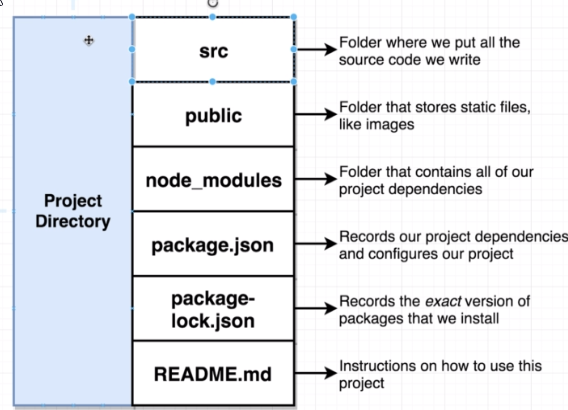
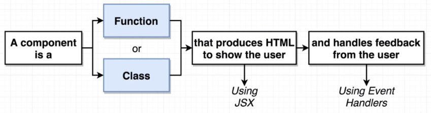
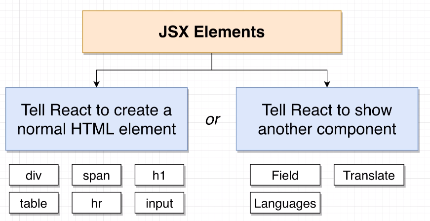
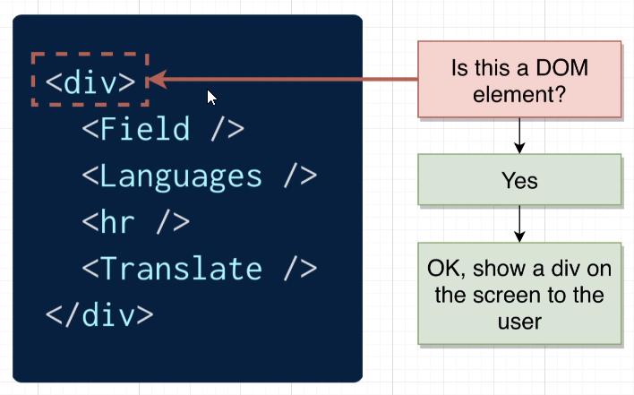
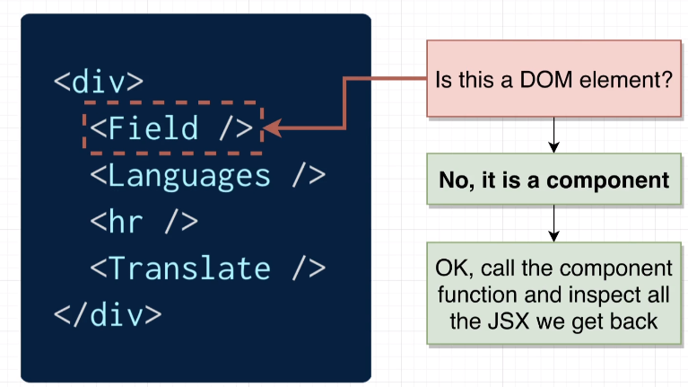
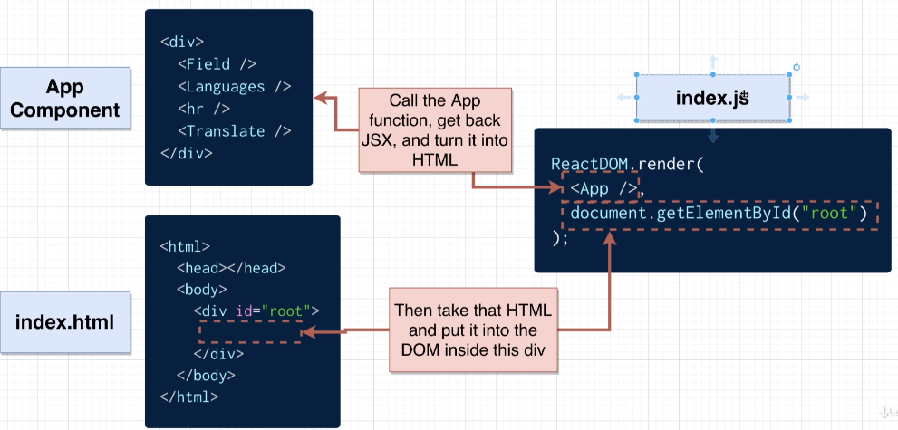
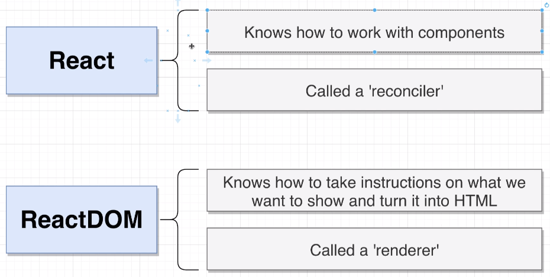
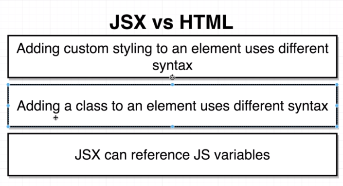
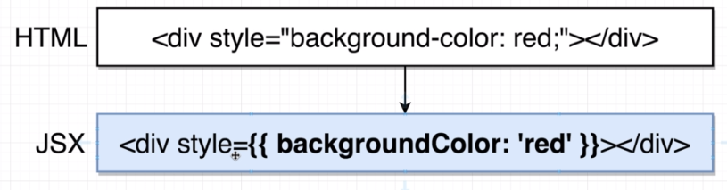
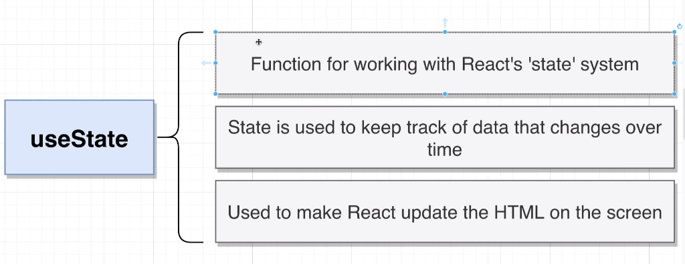

# Introduction to React

## Generating a Project and folder Structure

You can generate a new react project by simply calling

`npx create-react-app <app-name>`

The newly generated React projcet gets generated with this structure:



## About React Component

A React component is a plane Javascript function which returns some JSX.

A React Component has to jobs:

- They produce JSX which tells react what we want to show on the screen to the user
- Handle user events, such as the user typing into a text input or clicking on a button.



## About JSX



### JSX handling





## Rendering React



## React and ReactDOM Libraries



## JSX and HTML Differences



### Inline styling

First curly brace indicates that we want to reference a javascript variable the second curly brace is meant to indicate a javascript object.
Anytime you want to add any styling that has some dash you remove that dash and capitalize the next character.



### Adding class to an Element

Instead of 

`<label class="label" for="name">`

you would simply use

`<label className="label" for="name">`

To avoid collision with the JS-Keywoard of `class` but this will probably be removed in the future so you could then use class instead of className.

### JS variables in JSX

In JSX it is possible to reference JS variables like `buttonName` in this example:

````js
const App = () =>{
    const buttonName='submit';
    return (
        <div>
            <label className="label" for="name">
                Enter name:
            </label>
            <input id="name" type="text"/>
            <button style={{backgroundColor: 'blue', color:'white'}}>
                {buttonName}
            </button>
        </div>
    );
}
````

## UseState


