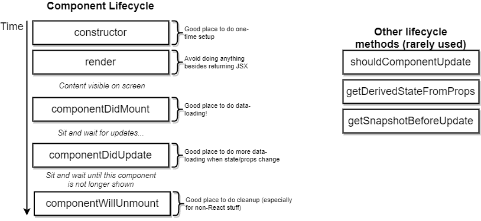

# React Lifecycle Methods

There exists multiple Lifecycle with different purpose which are seen in the list:

So it is common standard to handle all the data loading in `componentDidMount` instead of putting all the stuff into `constructor` (even if it would be technically possible). This helps to reduce the complexity of the code and also enables multiple developers to understand your code much faster.
