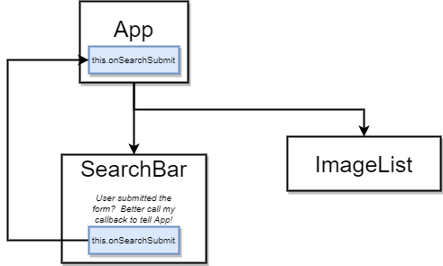

# React Parent Child Communication



First step is to refactor functional component into a class one . Then we can define a callback function. Add this function as a prop to SearchBar. In class based components you reference props with this

````js
/********
 * App.js - Parent
*********/
import React from 'react';
import SearchBar from './SearchBar';

class App extends React.Component {
   onSearchSubmit(term){
      console.log(term)
   }
   render(){
    return(
         <div className="ui container" style={{marginTop: '10px'}}>
            <SearchBar onSubmit={this.onSearchSubmit}/>
         </div>
         )
   }
}

export default App;

/********
 * SearchBar.js - Child
*********/
import React from 'react';

class SearchBar extends React.Component {

   state ={ term: '' };

   onFormSubmit=(event)=>{
       //prevent browser to reload the page when pressing enter
        event.preventDefault();
        //call onSubmit from parent (App) and invoce that with our state for term
       this.props.onSubmit(this.state.term);
   }
   
    render() {
        return (
        <div className="ui segment">
            <form onSubmit={this.onFormSubmit} className="ui form">
                <div className="field">
                    <label>Image Search</label>
                    <input type ="text" value={this.state.term} placeholder='Please enter text' onChange={e=>this.setState({term : e.target.value})}/>
                </div>
            </form>
        </div>)
    }
}

export default SearchBar;
````
