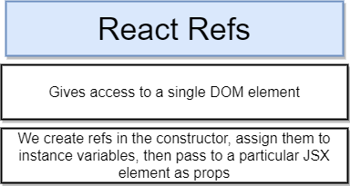

# React Refs

React Refs give you direct access to a single DOM element that is rendered by a component.

This is used in place of code like docment selector:

````js
// Get height of an image component
document.querySelector('img').clientHeight
````

We call a funciton inside the constructor to create a reference and assign it as a instance variable on our class. After that we are then going to go down to our render mehtod and pass that ref into some particular JSX element as a prop.



Example which console logs the height of each loaded image:

````js
import React from 'react';

class ImageCard extends React.Component {

    constructor(props){
        super(props);
        
        //Create ref in constructer
        this.imageRef=React.createRef();
    }
    componentDidMount(){
        //the current represent the image 
        //while the eventListener is waiting until the image has loaded
        // after that our callback funciton starts
        this.imageRef.current.addEventListener('load', this.setSpans);
      
    }
    setSpans=()=>{
        console.log(this.imageRef.current.clientHeight);
    }
    render() {
        const {description, urls}=this.props.image;
        return(
            <div>
                
            </div>
        )
    }
}

export default ImageCard;
````
