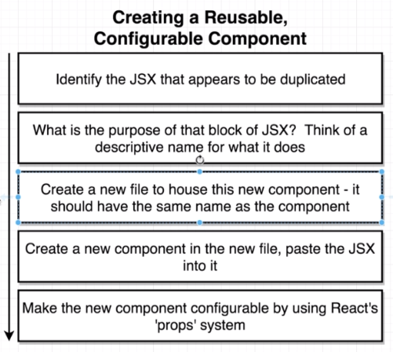
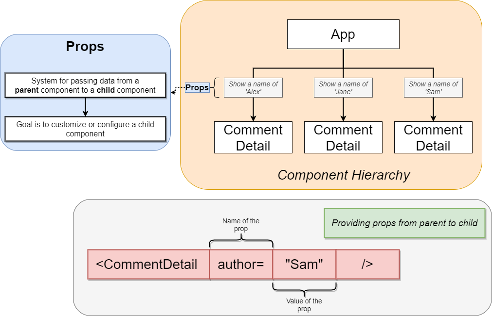

# How to create a Reusable Component



**Example:**

The following code is providing a styling for comments which will be duplicated for each new comment, therefore we want to create a reusable component for that to simplyfy the code.

````js
//Index.js

const App = () => {
 return (
  <div className="ui container comments">
   <div className="comment">
    <a href="/" className="avatar">
     
    </a>
    <div className="content">
     <a href="/" className="author">
      Sam
     </a>
     <div className="metadata">
      <span className="date">Today at 6</span>
     </div>
     <div className="text">Nice blog post!</div>
    </div>
   </div>
   <div className="comment">
    <a href="/" className="avatar">
     
    </a>
    <div className="content">
     <a href="/" className="author">
      Edwin
     </a>
     <div className="metadata">
      <span className="date">Today at 5</span>
     </div>
     <div className="text">Nice blog post!</div>
    </div>
   </div>
  </div>
 );
};
````

## Properties (Props)

First step is to create a new file in the Repository. It is common standard to start the component name with an **uppercase letter** we will name it `CommentDetail.js`.

After the extraction we need to copy the relevant code into the new function and use Props to make it able to call this component with individual content.



````js
// CommentDetail.js

import React from 'react';

//we could also just pass (props) and call {props.author} or {props.image}
const CommentDetail = ({author,date, image, text}) =>{
 //sometimes you need to inspect the props elements so you cann call
 //console.log(props)

    return (
        <div className="comment">
    <a href="/" className="avatar">
     
    </a>
    <div className="content">
     <a href="/" className="author">
      {author}
     </a>
     <div className="metadata">
      <span className="date">{date}</span>
     </div>
     <div className="text">{text}</div>
    </div>
   </div>
    )
}

export default CommentDetail;

````

````js
//index.js

import React from 'react';
import ReactDOM from 'react-dom';
import faker from 'faker';

import CommentDetail from './CommentDetail';

const App = () => {
 return (
  <div className="ui container comments">
   <CommentDetail author="Sam" date="Tdoay at 2" image={faker.image.avatar()} text="hi" />
   <CommentDetail author="John" date="Today at 4" image={faker.image.avatar()} text="Also hi" />
   <CommentDetail author="Jim" date="Yesterday at 2" image={faker.image.avatar()} text="Another hi" />
  </div>
 );
};

ReactDOM.render(<App />, document.querySelector('#root'));

````

## Custom Children

If we want to use a Component within another component we can make use of  the `children prop`.

````js
//Approval Card

import React from 'react';

const ApprovalCard = ({ children }) => {
 return (
  <div className="ui card">
   <div class="content">{children}</div>
   <div className="extra content">
    <div className="ui two buttons">
     <div class="ui basic green button">Approve</div>
     <div class="ui basic red button">Decline</div>
    </div>
   </div>
  </div>
 );
};

export default ApprovalCard;

````

````js
//CommentDetail

import React from 'react';


const CommentDetail = ({author,date, image, text}) =>{
    return (
        <div className="comment">
    <a href="/" className="avatar">
     
    </a>
    <div className="content">
     <a href="/" className="author">
      {author}
     </a>
     <div className="metadata">
      <span className="date">{date}</span>
     </div>
     <div className="text">{text}</div>
    </div>
   </div>
    )
}

export default CommentDetail;
````

Now we need to wrap `CommentDetail` within the `Approval` Component.

````js
// index.js
import React from 'react';
import ReactDOM from 'react-dom';
import faker from 'faker';

import CommentDetail from './CommentDetail';
import ApprovalCard from './ApprovalCard';

const App = () => {
 return (
  <div className="ui container comments">
   <ApprovalCard>
   <CommentDetail author="Jim" date="Yesterday at 2" image={faker.image.avatar()} text="Another hi" />
   </ApprovalCard>
  </div>
 );
};

ReactDOM.render(<App />, document.querySelector('#root'));

````
