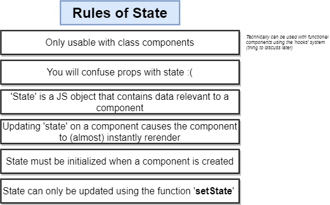

# React state



**Example:**

initialize State and update with setState.

````js
class App extends React.Component{
   // First function ever called when an instance of this class is created
    constructor (props) {
        //all the Code of Rect.component should still be called
        super(props);
        // intialize state
        // ONLY TIME where we do direct assignemnt to this.state
        this.state={lat:null, errorMessage:''};

        window.navigator.geolocation.getCurrentPosition(
            (position)=>{
                this.setState({lat:position.coords.latitude});
            },
            (err)=>{
                this.setState({errorMessage:'Cannot show the Geolocation'})
            }
        );

    }

    // Must Have: Define Render method to return jsx
    render() {     
       
            if(this.state.errorMessage && !this.state.lat){
                return  <div>
                Error:{this.state.errorMessage}
                </div>
            }
            if (!this.state.errorMessage && this.state.lat){
                return  <div>
                Latitude:{this.state.lat}
                </div>
            }
       return <div>Loading!</div>
    }
}
````

Alternative Way of Initialize the state instead of using the constructor:

````js
class App extends React.Component{

    state={lat:null, errorMessage:''}

    componentDidMount(){
        console.log('My component was rendered to the screen');

        window.navigator.geolocation.getCurrentPosition(
            (position)=>{
                this.setState({lat:position.coords.latitude});
            },
            (err)=>{
                this.setState({errorMessage:'Cannot show the Geolocation'})
            }
        );
    }

    // Must Have: Define Render method to return jsx
    render() {     
       
            if(this.state.errorMessage && !this.state.lat){
                return  <div>
                Error:{this.state.errorMessage}
                </div>
            }
            if (!this.state.errorMessage && this.state.lat){
                return  <div>
                Latitude:{this.state.lat}
                </div>
            }
       return <div>Loading!</div>
    }
}
````
