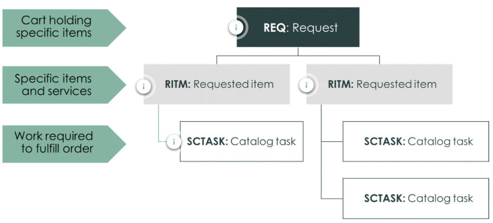
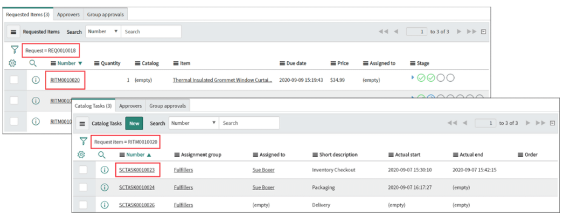
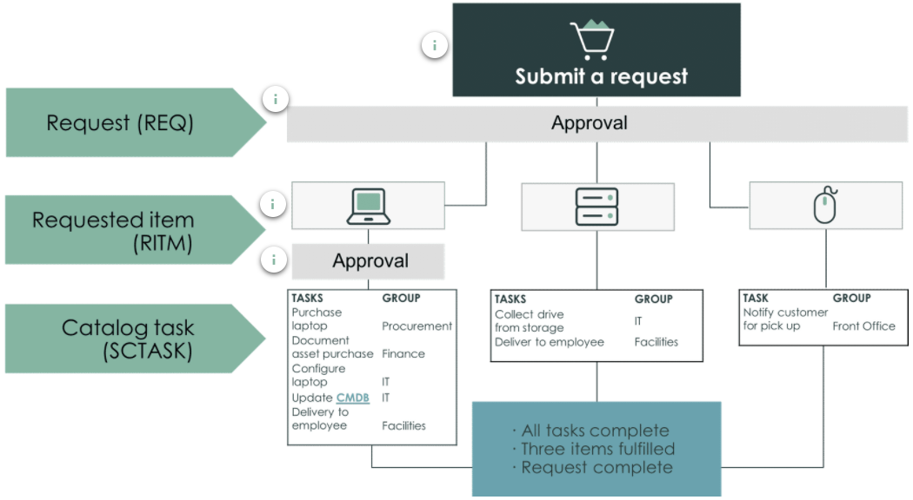
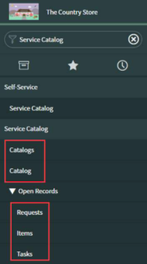

# Request Management

## Request Management Goals

- Ensure all users in the organization are made aware of and can easily request all services offered by IT
- Provide a consistent and repeatable process for requesting and fulfilling services to ensure that users expectations are clearly set and continually met, thus maintaining high customer satisfaction levels
- Ensure that all new services can quicly be offered in the catalog as soon as they become a vaialable

## Request Management Lifecycle

Each Request has consists of the following Components:

- **Request(REQ):** The Request which was created which has a dedicated REQ ID
- **Requested Item (RITM):** The Item which was requested, whch has a dedicated RITM ID
- **Service Catalaog Task (SCTASK):** The Tasks which needs to be handled in order to fulfill the request. Every task has an individual SCTASK ID

In some cases the may one or more approval necessary to fulfill the Request. In this case we will have addtional approval Steps included:

## ServiceNow Platform Navigation

Basic Navigation of the Service Catalog:

- **Catalogs:** The **Catalogs** Module displays all available service catalogs. Access is per default global but can be restricted.
- **Catalog:** The **Catalog** module is a shortcut to display the primary service catalog to begin browsing items and services.
- **Requests:** Requests have an REQ prefix. They act as a container for all the items orderd in a particular submittal.
- **Items:** Items have an RITM prefix. Each item record documents one particular service or piece of quipment that has been requested. The workflow associated with each item record governs the specific approvals and fulfillment tasks fo that specific item.
- **Tasks:** Tasks have a prefix of SCTASK or simply TASK. Each record represents one activity in a series of one or more activities that process users complete to achieve the fulfillment of a specific item

## Request Steps

### Submittal

There exists multiple ways to create a request:

1. From the service catalog
2. From an incident record (e.g. ordering a new PC when PC is broken)

You can have multiple items in one request, you could also offer bundles (set of items) to your customers.
After submitting the order you see for each item the request number, description, status, quantity and price. The status gives you the possiblity to track the state of your order for each item individualy.

### Approval

Some basic rules:

- If the RITM is preapproved, fulfillment can begin immediatly upon submittal of the request

- If there are multiple items in the request, the rejection of one RITM does not affect the fulfillment of other RITMs.

### Fulfillment

Tasks can be viewed under **Service Desk** -> My Work/My Groups Work

### Closure

Automatic closure of parent elements:

- When all tasks are marked as complete the parent RITM is set to Complete by the workflow.
- When all RITM are set to complete the parent request is set to Complete by the workflow.

> If the record in the Catalog Tasks tab has an Actual end date, that task is closed

Closing States:

- **Closed Complete:** Work completed as requested
- **Closed Incomplete:** Work that was requested was partially completed (NOTES should clearly identify what was not completed and why!-> Manual task)
- **Closed Rejected:** Work that was requested could not be completed(NOTES should clearly identify why!-> Manual task)
- **Closed Cancelled:** User who requested the work cancelled their request(NOTES should clearly identify who and why!-> Manual task)

## Summary

1. Among the three phases of the ITSM cycle, the Operate phase focuses on provisioning products and services to meet business needs.
2. The service catalog application is the conduit for ordering and delivering requested products and services. It works with request management to ensure efficient delivery.
3. The service catalog application helps create one or multiple catalogs of products and services and these are organized into categories and subcategories.
4. Service catalog interacts with other processes in many ways, for example, it creates new changes using standard change items, new incidents using record producers, new catalog item records to tracks new hardware/software.
5. The service portal is a portal framework that allows administrators to build self-service experience for the end users (internal and external) to view and order catalog items.
6. Request Management application tracks the request of products and services from initial submission in the Service Catalog through closure of the request once it has been approved and fulfilled.
7. Submittal is the first stage of the request management lifecycle. Process users and end users search the service catalog to place an order, fills out required order form and submits the request.
8. A request can also be submitted through the service catalog application and from an incident record as well. Regardless of the specific item or items ordered, all requests for goods and services are structured similarly.
9. Approval stage is where requests and/or requested items are approved or rejected. Once a request is submitted, a predefined approval workflow is launched for the overall request, followed by the individual requested items.
10. Approvals can be at the request level only or both at the request and requested item levels.
11. After approval, the Fulfillment stage is when the work required to deliver the requested products / services is started and completed.
12. Fulfillment stage is automatically initiated by the workflow when all the required approvals (if any) have been granted.
13. In the final Closure stage, all the requisite fulfillment tasks are completed, and the requested item and request records are closed automatically.
